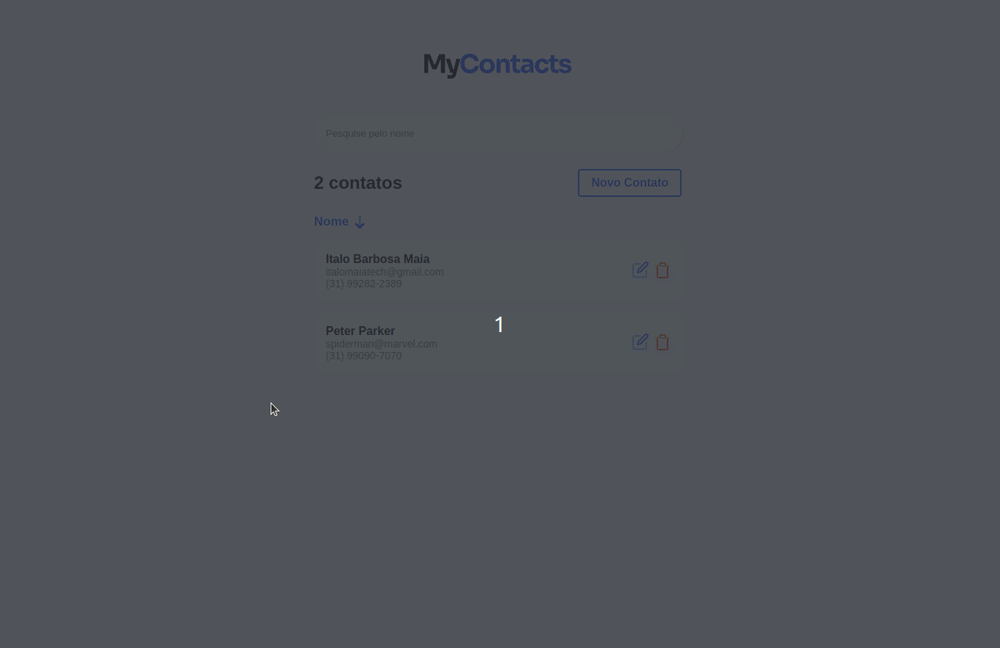

# Seja Bem Vindo ao MyContacts !
<br>

<!-- ### O Projeto ainda está sendo construído, 
## O BackEnd ainda está sem deploy. Mas caso voce deseje ver a aplicação completa,basta seguir o passo a passo:  -->

## 💻 Projeto
Projeto que permite você criar contatos, edite, delete e ordene seus contatos.
<br>

<br>
Este projeto está em construção. 🚧👷‍♂️

<br>

# Preview 🚀

   <p align="center">
      
   </p>


*Simples preview do Front-End deste projeto clicando baixo:*
### Link: [MyContacs](https://mycontacts-gold.vercel.app) 🖱

<br>

## 🚀 Tecnologias

Tecnologias utilizadas durante o projeto:
- [NextJS](https://pt-br.reactjs.org/)
- [NodeJS](https://nodejs.org/en/)
- [JavaScript](https://www.javascript.com/)
- [Express](https://expressjs.com/pt-br/)
- [Docker](https://www.docker.com/)
- [Postgres](https://www.postgresql.org/)
- [Styled Components](https://styled-components.com/)
- [Eslint](https://eslint.org/)
- [EditorConfig](https://editorconfig.org/)

<br>

## 😎 Lets Bora 

📖 Para rodar o projeto localmente você precisará seguir algumas instruções.

- É necessário que o <a href="https://nodejs.org/en/">NodeJS</a> esteja instalado em sua máquina.
- É necessário que o <a href="https://www.docker.com/">Docker</a> esteja instalado em sua máquina.
- É necessário utilizar <a href="https://classic.yarnpkg.com/en/">Yarn</a> para a instalação de pacotes.

<br>

### Instalação
```bash
# Clone o repositório
git clone https://github.com/Italo-Maia/my-contacts.git

# É importante você entrar em cada uma das pastas, e instalar os pacotes, por exemplo: 

## cd back/  
## Execute o comando: yarn install

## cd front/ 
## Execute o comando: yarn install

# Rodar o Docker - Postgres[https://hub.docker.com/_/postgres]

- Comandos
Baixando a imagem - postgres: docker pull postgres
Criando o container: docker run --name pg -e POSTGRES_USER=root -e POSTGRES_PASSWORD=root -p 5432:5432 -d postgres (Já inicia automaticamente)
Caso não tenha iniciado o container, faça o seguinte comando: docker start pg
Verificar se o container está rodando: docker ps

```

